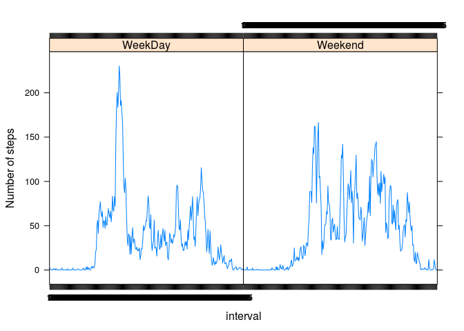

# Reproducible Research: Peer Assessment 1


## Loading and preprocessing the data

```r
library(ggplot2)
library(plyr)
library(lattice)
actUnzip <- unzip("/home/ahsan/Personal/RRpro1/RepData_PeerAssessment1/activity.zip")
stepsData <- read.csv(actUnzip)
stepsData$date<-as.Date(stepsData$date)
stepsData$interval<- as.factor(stepsData$interval)
```


## What is mean total number of steps taken per day?
The mean number of steps taken each day is 37.3825996 whereas the median is given as 0.

```r
sumSteps <- tapply(stepsData$steps,stepsData$date,sum)
hist(sumSteps,xlab = "",main ="Histogram of total of steps taken per day")
```

 


## What is the average daily activity pattern?

```r
InterAve <- tapply(stepsData$steps,stepsData$interval,mean,na.rm = TRUE)
plot(names(InterAve),InterAve,type = "l",main = "Average number of steps taken across day in intervals")
```

 

```r
maxIntervalNumber <- which.max(InterAve)
```
On average across all the days in the dataset, interval 835 contains the maximum number of steps.

## Imputing missing values
The number of missing values are 2304. Mean of five minute interval is used for imputing missing values in the data set as follows:

```r
stepsNA <- stepsData[is.na(stepsData$steps),]
facInter <- factor(stepsNA$interval)
stepImputed<- stepsData
for(i in 1:length(facInter)){
  stepImputed$steps[stepsData$interval == facInter[i] & is.na(stepsData$steps)] <- InterAve[[facInter[i]]]
}
sumStepsIm <- tapply(stepImputed$steps,stepImputed$date,sum)
hist(sumStepsIm,xlab = "",main ="Histogram of total number of steps per day with imputed data")
```

 
The mean number of steps taken each day after imputation is 37.3825996 as compared to previous mean given as 37.3825996. The new median after imputation is  0 whereas the previous median was given as 0. I don't get why they are equal. I've checked the code and imputations and everything seems correct. 

## Are there differences in activity patterns between weekdays and weekends?

```r
Sys.setlocale("LC_TIME","C")
```

```
## [1] "C"
```

```r
weekend <- (weekdays(stepImputed$date)== "Sunday" | weekdays(stepImputed$date)== "Saturday")

weekendData  <- stepImputed[weekend,]
weekdaysDat <- stepImputed[!weekend,]
stepsDataW <- stepsData
stepsDataW$week[weekend] <- "Weekend" 
stepsDataW$week[!weekend] <- "WeekDays" 
InterAveWk <- ddply(weekendData,"interval",function(x){data.frame(meanStep = mean(x$steps),dayType = "Weekend")})
InterAveNWk <- ddply(weekdaysDat,"interval",function(x){data.frame(meanStep = mean(x$steps),dayType = "WeekDay")})
newDat <- rbind.data.frame(InterAveNWk,InterAveWk)
newDat$dayType <- as.factor(newDat$dayType)
xyplot(meanStep~interval|dayType,data = newDat,type = "l",ylab = "Number of steps")
```

 

As can be seen from the plot above, there is overall more activity on the weekend. But the spike of steps taken is on weekdays probably due to work timings kicking in at the start of morning.
